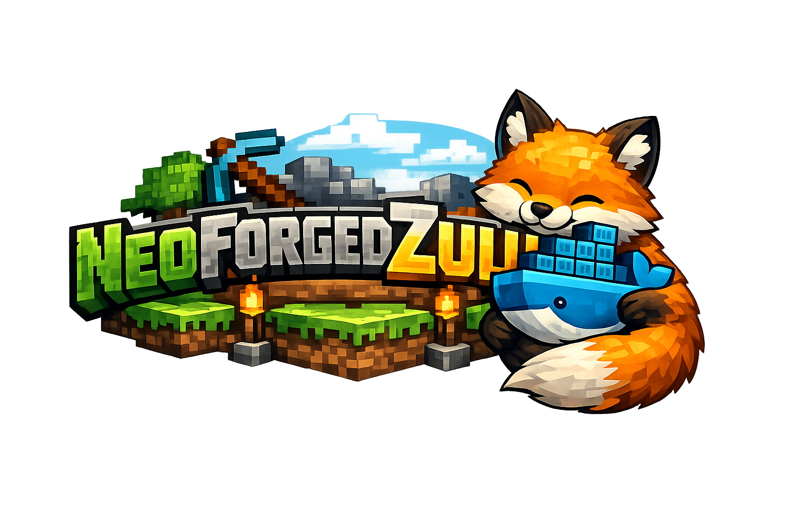

<center>

</center>

> [!NOTE]
> **EPIC DISCLAIMER**: Yes, the logo was created using AI. Honestly, I really don't care. Billionaire corporations and recently AI Bros (not you, obviously) have been scraping our code and art without asking, so, imho, using it for an open source repo is not a big deal.
> Got a better idea for the logo? Send a PR :3

> [!WARNING]
> **Work in Progress**: This image is currently running stable on my personal server, but it hasn't been extensively tested with all mod combinations.
> Please contact the original mod authors for mod-specific support. Don't ask me for help with mods. I'm not a modder.

# NeoForge Server on Zulu OpenJDK

A lightweight, high-performance Docker image for running a [NeoForge](https://neoforged.net/) Minecraft server. It is built on top of **Azul Zulu OpenJDK** (Alpine Linux) to ensure minimal footprint and maximum performance.

## ❓ What is this?
This project provides a production-ready Docker image for hosting a NeoForge Minecraft Server. It handles the installation of the specific NeoForge versions defined in the repository, ensuring reproducibility.

## 🛠 How it works
Unlike other images that download the latest version on every startup, this image uses a **Pinned Version Strategy**:
1. An automated workflow checks daily for new NeoForge updates.
2. If an update is found, it validates it and creates a Pull Request to this repository.
3. Upon merging, a new Docker image is built with those exact versions baked in.
4. Your server downloads this immutable image, ensuring that `latest` assumes a tested and specific version, preventing random breaks on restart.

## 💡 Why was this made?
- **Performance**: Using Alpine Linux + Zulu OpenJDK provides a very slim and fast Java environment.
- **Stability**: By pinning versions in the image build process (instead of a startup script), we guarantee that the server environment is identical across restarts until you explicitly decide to update the image.
- **Simplicity**: No complex startup flags to configure versions; just pull and run.
- **Multi-Architecture**: Supports both AMD64 and ARM64 architectures. (actually tested on ubuntu server 24.04 over oracle cloud and proxmox VMs)
- **Podman Support**: Verified on my M1 Mac. It didn't explode, so I'm officially awarding it the "Works on My Machine" certification. If it breaks for you, you are now the lead debugger. Congratulations!
- **Benchmarks**: ¯\_(ツ)_/¯ I don't know... it just works.

---

## 🚀 Quick Start

### Option 1: Docker Compose (Recommended)
This is the easiest way to manage your server.

1. Create a `docker-compose.yml` file:
   ```yaml
   services:
     neoforgeserver:
       image: ghcr.io/alvarosdev/docker-neoforge-zulu:latest
       container_name: neoforgeserver
       restart: unless-stopped
       ports:
         - "25565:25565"
       volumes:
         - ./neoforge/mods:/data/mods  # Place mods here
         - ./neoforge/world:/data/world # World data
         - ./neoforge/config:/data/config # Config files
         # If you need full access to the files from the host, you can use the following:
         # Avoid using this with the volumes above, could cause conflicts
         - ./neoforge:/data
       environment:
         - MEMORYSIZE=4G
         - TZ=America/Santiago
         - PUID=
         - GUID=
   ```

2. Start the server:
   ```bash
   docker-compose up -d
   ```
   *(Note: If using Podman, use `podman compose up -d`)*

### Option 2: Docker CLI
If you prefer running a single command:

```bash
docker run -d \
  --name neoforgeserver \
  -p 25565:25565 \
  -v $(pwd)/neoforge/mods:/data/mods \
  -v $(pwd)/neoforge/world:/data/world \
  -v $(pwd)/neoforge/config:/data/config \
  -e MEMORYSIZE=4G \
  ghcr.io/alvarosdev/docker-neoforge-zulu:latest
```

---

## 📦 Managing Mods & Data

All your server data is stored in the local `neoforge/` directory which is mounted into the container.

**To install mods:**
1. Download the `.jar` files for your mods (matching the Minecraft version).
2. Place them in the `neoforge/mods` folder on your host machine.
3. Restart the server.

---

## 🤖 Using the Makefile
This project includes a `Makefile` to simplify common operations. You can use it if you have `make` installed (Linux/macOS/WSL).

| Command | Description |
| :--- | :--- |
| `make up` | Starts the server in background (`docker-compose up -d`). |
| `make stop` | Stops the server gracefully (`docker-compose stop`). |
| `make down` | Stops and removes containers and networks (keeps volumes). |
| `make restart` | Restarts the container (useful after adding mods). |
| `make logs` | Follows the last 50 lines of logs. |
| `make attach` | Attaches to the server console. **Use `Ctrl+P`, `Ctrl+Q` to detach!** `Ctrl+C` will kill the server. |
| `make update` | Pulls the latest image and restarts the server (replaces `make update-container`). |
| `make build` | Rebuilds the image locally using the `Dockerfile` with zero cache. |
| `make clean` | **WARNING**: Stops server and deletes **ALL** data (including world/mods). |

Example:
```bash
make logs
```
